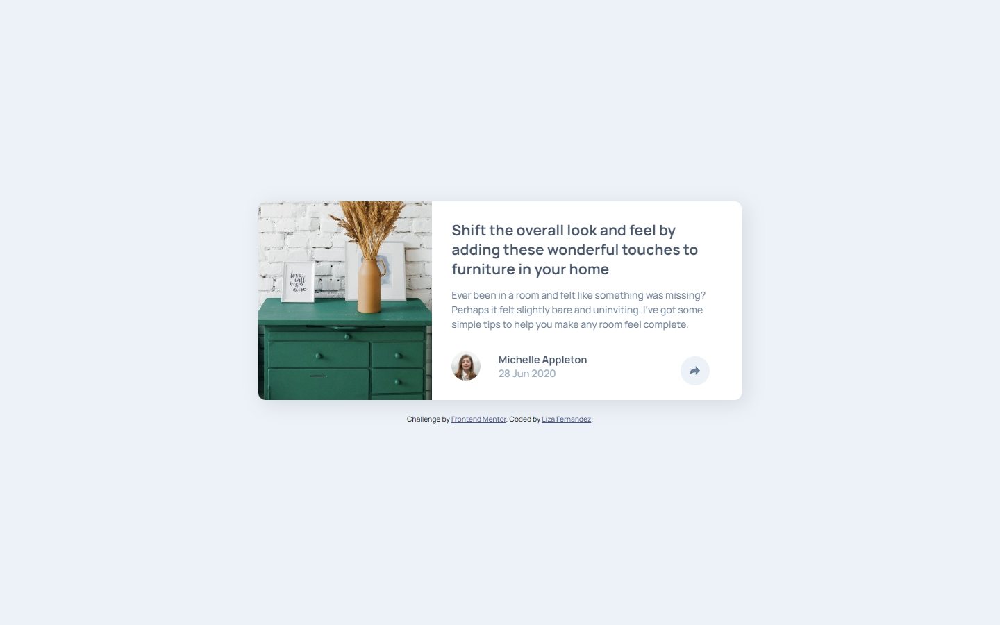
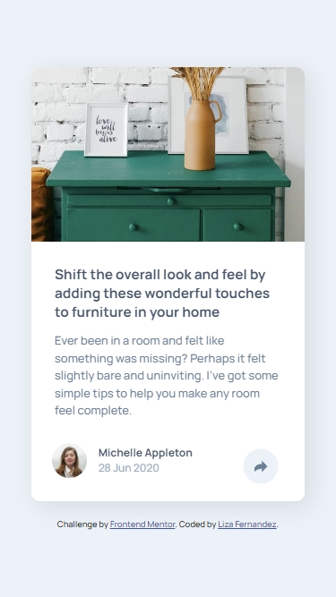

# Frontend Mentor - Article preview component solution

This is a solution to the [Article preview component challenge on Frontend Mentor](https://www.frontendmentor.io/challenges/article-preview-component-dYBN_pYFT). Frontend Mentor challenges help you improve your coding skills by building realistic projects.

## Table of contents

- [Overview](#overview)
  - [The challenge](#the-challenge)
  - [Screenshot](#screenshot)
  - [Links](#links)
- [My process](#my-process)
  - [Built with](#built-with)
  - [What I learned](#what-i-learned)
  - [Continued development](#continued-development)
  - [Useful resources](#useful-resources)
- [Author](#author)

## Overview

### The challenge

Users should be able to:

- View the optimal layout for the component depending on their device's screen size
- See the social media share links when they click the share icon

### Screenshot

**Desktop Preview**



**Mobile Preview**



### Links

- Solution URL: [Add solution URL here](https://your-solution-url.com)
- Live Site URL: [https://article-preview-component-solution-lf.netlify.app](https://article-preview-component-solution-lf.netlify.app)

## My process

### Built with

- Semantic HTML5 markup
- CSS custom properties
- Flexbox
- CSS Grid
- Mobile-first workflow
- SASS
- BEM (Block, Element, Modifier)
- Javascript

### What I learned

This project allowed me to reinforce my skills and knowledge of javascript. In particular, this project required a share button, that would display a popup showing links to different social media. The mobile design of the popup was quite simple unlike the desktop layout. The desktop design for the popup was a speech bubble-like shape.

I found a CSS online that I could use and adjust to fit the design. Below is the original CSS. For this project to fit the design requirements, I changed the width, padding and background-color.

```css
#share-popup {
/* Original CSS from is #5 from: https://css-generators.com/tooltip-speech-bubble/ */
@include mixins.breakpoint($breakpoint-desktop) {
    /* Controls the design of the popup on desktop
    /* HTML: <div class="tooltip">This is a Speech Bubble with a solid coloration and with border radius </div> */
    color: #fff;
    font-size: 18px;
    max-width: 28ch;
    text-align: center;
   
    /* triangle dimension */

    --b: 2em; /* base */
    --h: 1em; /* height */
    --p: 50%; /* triangle position (0%:left 100%:right) */
    --r: 1.2em; /* the radius */
    --c: #{$primary-font-color}; /* background-color */

    padding: 1em;
    border-radius: var(--r) var(--r)
      min(var(--r), 100% - var(--p) - var(--b) / 2)
      min(var(--r), var(--p) - var(--b) / 2) / var(--r);
    clip-path: polygon(
      0 100%,
      0 0,
      100% 0,
      100% 100%,
      min(100%, var(--p) + var(--b) / 2) 100%,
      var(--p) calc(100% + var(--h)),
      max(0%, var(--p) - var(--b) / 2) 100%
    );

    background: var(--c);
    border-image: conic-gradient(var(--c) 0 0) fill 0 / var(--r)
      calc(100% - var(--p) - var(--b) / 2) 0 calc(var(--p) - var(--b) / 2) / 0 0
      var(--h) 0;
     
    /* Controls Position of the popup on desktop */
    top: 0;
    bottom: 0;
    width: 20rem; /* Set a fixed width for the popup
  }
  }

```

I had issues setting the background color of the popup. The main issue was that I used a Sass variable for the color. The original code, was using custom CSS properties to set the color. To solve this issue, I had to use Sass interpolation #{variable}, for my color variable. Without this, the compiled CSS had the variable name, instead of the color value.

I used a variable for the popup width to make changes to width easier and more maintainable.

### Continued development

I would like to further reinforce and gain knowledge and skills in using Javascript.

### Useful resources

[CSS Shapes](https://css-shape.com) - This resource provides CSS for an assortment ot shapes. I found the speech bubble-like shape of the desktop layout popup share menu.

[Fluid Type Scale Calculator](https://www.fluid-type-scale.com/calculate) - A calculator that I used to generate the font size variables for fluid typography that uses CSS clamp. Allows font-size to adjust based on viewport width, improving responsiveness

## Author

- Website - [Liza Fernandez](https://www.lizafernandez.com)
- Frontend Mentor - [@aelvanna](https://www.frontendmentor.io/profile/aelvanna)
- Twitter - [@aelvanna](https://www.twitter.com/yourusername)
